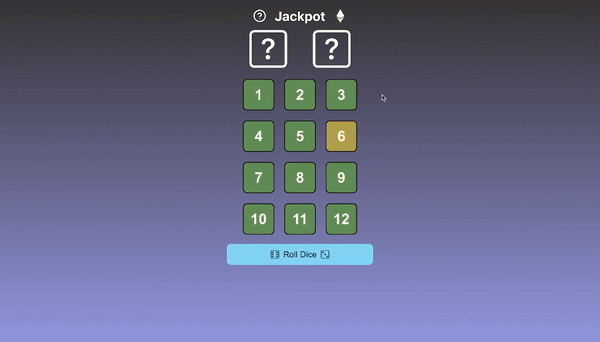
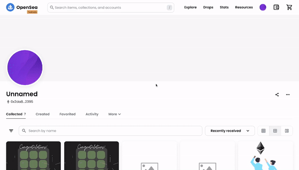

# Web3-MegaJackpot


[](https://opensource.org/licenses/MIT)

---

## Project Description

This project is a web 3 version of [one of my previous projects](https://github.com/dansmith09/Mega-Jackpot).


The dApp allows users to connect their Metamask wallets and mint an NFT upon completion of the web game.

## Table of Contents

- [Installation](#installation)

- [Usage](#usage)

- [License](#license)

- [Demo](#demo)

- [Questions](#questions)

---

## Installation

To use the application, please navigate to the following webpage:

```
https://web3-mega-jackpot.vercel.app/
```

## Usage

Navigate to the above URL and make sure you have Metamask installed and switched to Goerli Testnet

## License

This project's type license is MIT. You can find out more about this license [here](https://opensource.org/licenses/MIT).

## Demo

Click the Ethereum logo to activate web 3 mode. Once your wallet is connected the web 3 toggle will be on and the Ethereum logo will be purple to let you know you're connected.

If and when you manage to defeat the game you will be prompted to mint a 'Proof of Persistence' NFT.

[](https://web3-mega-jackpot.vercel.app/ "Click here to try for yourself!")

After the transaction is complete head to the goerli test net opensea to see your new ERC721!

[](https://web3-mega-jackpot.vercel.app/ "Click here to try for yourself!")

## Questions

You can find more of my work at [dansmith09](https://github.com/dansmith09)

---

[](https://github.com/dansmith09)
---

